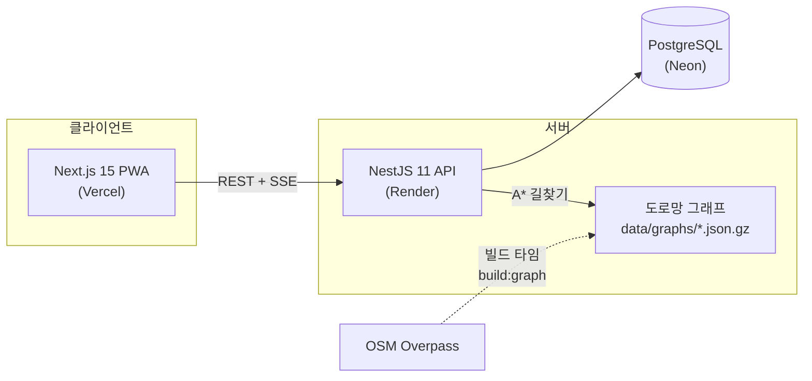

# MOCAR — 카셰어링 시스템 데모

> 쏘카 Product Engineer 포지션 지원을 위해 만든 데모 프로젝트입니다.
> **㈜쏘카와 무관한 개인 학습/포트폴리오용 프로젝트**이며, 결제는 모두 모의(Mock)로 동작합니다.

모빌리티 도메인의 핵심 문제 — **실시간 예약 동시성, 결제 멱등성, 대여 라이프사이클, 운영 의사결정** — 를
End-to-End(기획 → 설계 → 구현 → 테스트 → 배포)로 구현했습니다.

**데모**: 웹 https://socar-demo.vercel.app · API https://mocar-api-d07z.onrender.com/health
(Render 무료 티어는 유휴 시 슬립 상태가 되어 첫 요청에 30초쯤 걸릴 수 있어요)

## 공고 요구사항 ↔ 구현 매핑

| 공고에서 요구한 것 | 이 프로젝트에서 보여주는 것 |
|---|---|
| 모빌리티·결제·실시간 트랜잭션 도메인 | 예약 동시성 제어([ADR-001](docs/adr/001-reservation-concurrency.md)), 모의 PG 멱등성([ADR-002](docs/adr/002-payment-idempotency.md)), 대여~반납 상태 머신 |
| 제품 문제 영역의 owner로서 End-to-End | 기획(요구 정의) → 도메인 설계 → API/웹 구현 → 테스트 → 클라우드 배포 → 운영 지표까지 단독 수행 |
| 기술 스택 경계를 넘는 문제 해결 | 백엔드(NestJS) + 프론트(Next.js) + 데이터(SQL 지표 집계) + 알고리즘(A* 길찾기) + 인프라(배포 파이프라인) |
| 사용자 의사결정을 돕는 제품 감각 | 법인 배차: 자동 배정 대신 **근거를 제시하는 추천 + 담당자 승인**([ADR-003](docs/adr/003-dispatch-scoring.md)) |
| AI 에이전트를 업무에 깊이 통합 | Claude Code로 전 과정을 진행 — [AI 워크플로 기록](docs/ai-workflow.md) |

## 기능

**개인 이용자 (모바일 PWA)** — 실제 앱의 예약 모델을 따름
- **이용 시간을 먼저 정하고** 지도에서 그 시간에 가용한 존/차량 + 예상 요금 탐색 (전국 시드)
- 최소 30분부터 **10분 단위** 예약, 이용 전 **시간·반납 존 변경**(차액은 추가 결제/크레딧 환급), 이용 중 **반납 연장** (뒤 예약과 충돌 시 409)
- **편도 예약**: 다른 존에 반납 — 차량 위치가 예약 체인을 따라 이동 ([ADR-005](docs/adr/005-oneway-vehicle-location.md))
- **부름(탁송) 수령**: 검색 결과가 "바로 픽업"과 "부름으로 가져와 이용"으로 구분 표시 — 직전 반납 + A* 탁송 시간 기반 가용성 판정 ([ADR-006](docs/adr/006-bureum-delivery.md))
- 면책상품 3종(자기부담금 0/30/70만원) + 쿠폰/크레딧 + 모의 결제 (카드 `0000` 승인 거절 데모)
- **이용 플로우**: 대여 개시 → ① **체크인**(차량 상태 촬영+메모) → ② **가상 스마트키**(문/시동/비상등/경적)
  + **차종별 매뉴얼** → ③ 이용 중(연장·사고 접수) → ④ **체크아웃**(주차 위치 촬영+층/구역) → ⑤ 반납·정산.
  체크인해야 스마트키가 열리고 체크아웃해야 반납이 열린다 ([ADR-007](docs/adr/007-checkin-gate-smartkey.md))
- **문의 접수**(차량/예약/반납/사고/기타)와 **사고 접수(모의)** — 접수 화면에서 가입한 면책상품의
  자기부담금과 모의 보험사 안내를 그 자리에서 보여준다
- 반납하기 원클릭 → 주행거리 자동 확정(모의 텔레메트리) → **30km 무료·전기차 전면 무료** 주행요금 정산

**MOCAR 비즈니스 (법인 플릿/리스 관리, `/biz`)** — 실제 쏘카 B2B 라인업(쏘카 비즈니스 + 쏘카 FMS)을
리서치해 구성. 소비자 앱에 얹힌 부속이 아니라 **분리된 서비스 경계**(전용 셸 · 전용 API 네임스페이스 ·
포트/어댑터로 좁힌 의존)로 만들었다 ([ADR-010](docs/adr/010-biz-separation-and-permissions.md))

- **권한은 전역 역할이 아니라 법인 등급에서 나온다** — `VIEWER`(조회) → `REQUESTER`(요청) →
  `APPROVER`(승인·보드) → `MANAGER`(멤버 등급·플릿/리스). 등급→권한 매핑이 shared 상수 하나뿐이라
  API 가드와 화면 분기가 같은 표를 보고, 등급 변경은 **토큰 재발급 없이 즉시** 반영된다
- **배차** — 법인 전용 차량(= 리스 차량) 우선, 부족하면 인근 공유존 차량 폴백.
  전용 차량은 이용 과금 없음(월 리스료로 이미 지불) + 운행일지 자동 기록, 공유 차량은 법인카드 시간당 과금
- 임직원이 차량 요청 → 시스템이 후보 차량을 **근거와 함께** 추천:
  - 전용/공유 여부와 비용 (전용 배지 표시)
  - 오피스 → 존까지 **실제 도로망 A\* 도보 시간** (OSM 기반, 전국 지원)
  - 직전 예약 반납 후 버퍼 시간
  - 차량별 최근 30일 지연 반납 리스크
- 승인 권한이 있는 사람이 근거를 보고 승인/반려 → 승인 시 동시성 제어를 거쳐 예약 생성
- 차량 × 시간 타임라인 보드 · 전용존/전용 차량은 일반 이용자에게 비노출
- **플릿 현황** — 차량별 리스 계약 · 월 리스료 · 만기 D-day(임박 강조) · 최근 30일 이용률 ·
  운행일지 · 이용 임직원 통계 · 월 총 리스 비용 합계
- **리스 연장/해지 워크플로** — 법인은 *요청*까지, 운영 어드민이 *결정*한다.
  승인 시 만기가 옮겨지거나 계약이 종료된다 (법인이 스스로 만기를 바꿀 수 있으면 계약이 아니므로)
- **멤버 등급 관리** — 법인 관리자가 임직원 등급을 부여/변경 (본인 강등은 불가 — 관리자 0명 방지)

**핸들러 — 운송기사 (`/handler`)** — 부름을 "차가 알아서 오는 기능"이 아니라 **사람이 하는 일**로
모델링했다. 예약 한 건이 작업 두 건(배달 → 회수)으로 이어지고, 차량의 실제 위치는 그 작업이
끝날 때 확정된다 ([ADR-008](docs/adr/008-handler-task-system.md))

- **작업은 예약 생명주기가 낳는다** — 부름 결제 승인 → `DELIVERY`(기한 = 이용 시작 − 60분),
  반납 정산 완료 → `RETRIEVE`(수령지 → 원래 존). 둘 다 **예약/정산과 같은 트랜잭션**에서
  만들어진다 (결제는 됐는데 배달 작업이 없는 상태를 만들지 않는다)
- **작업 큐** — 오늘 / 예정 / 수락 가능한 공개 작업 / 최근 완료 이력. 기한이 지난 작업은 지연 경고,
  카드마다 출발·도착과 **도로망 A\* 예상 이동 시간**
- **수락 → 이동 시작 → 완료(인계 사진 + 메모)**. 완료가 차량의 실물 상태를 갱신한다 —
  잠금·시동 꺼짐은 공통, **존 이동은 회수·재배치만**(배달은 제자리 회수라 소속 존을 유지)
- **이동을 시작한 작업은 취소도 재배정도 되지 않는다** — 차 키를 쥔 사람과 작업이 갈라지면
  차량의 실제 위치를 아무도 책임지지 않는다. 출구는 완료 하나뿐
- 전이 규칙은 shared 한 벌(`schemas/handler-task.ts`) — 화면의 버튼 활성 조건과 서버의 거절 조건이
  같은 표를 본다

**운영 센터 (운영 어드민, `/dashboard`)** — 매출 대시보드였던 화면을 **6탭 운영 도구**로
다시 만들었다. 탭 경계는 도메인 모델이 아니라 **운영자가 답을 찾는 질문**을 따른다
([ADR-009](docs/adr/009-ops-backoffice-telemetry.md))

| 탭 | 답하는 질문 | 하는 일 |
|---|---|---|
| **운영 홈** | 지금 뭐가 잘못돼 있나? | 상단 스탯(운행·탁송·오늘 예약·미배정 작업) · **경고 피드 4종**(연료 부족 · 보험 만기 D-30 · 존 계약 만료 D-30 · 지연 반납 진행 중) · SSE 실시간 차량 지도 |
| **차량** | 이 차는 지금 뭘 하고 있나? | 전 차량 표(상태 배지·연료 게이지·주행거리·다음 예약·보험 D-day) · 상세 패널(센서 · 스마트키 조작 이력 · 도입/보험 · 정비 메모) · 신규 차량 등록 |
| **작업/배차** | 아무도 안 맡은 일이 있나? | 미배정 작업 큐 → 후보 핸들러를 **점수가 아니라 근거**와 함께 제시하고 배정 · 진행 중 보드 · 핸들러별 오늘 처리량 · 존 간 **재배치 작업** 생성 |
| **존/계약** | 이 존에 차를 더 보내도 되나? | 존별 유·무료 배지 · 제휴사 · 월 비용 · 계약 만기 · **면수 대비 잔여 자리**(초과 배정은 음수 그대로) · 계약 수정 |
| **고객** | 조심해야 할 이용자가 있나? | **유의 유저**(최근 30일 지연 반납·사고 접수·결제 거절 집계, 임계 초과만) · 문의함 답변(재답변 불가) |
| **회계** | 이번 달 남았나 밑졌나? | 월 손익 = 매출(이용 결제 + 법인 리스 청구) − 비용(차량 리스료 + 보험료 + 주차장 계약비) · 옛 매출/예약/가동률 지표와 일별 차트가 이 탭으로 이사 |
| **리포트** | 내가 궁금한 걸 직접 물어보려면? | 지표 5종 × 축(일자/존/차종) × 기간·존·차종 필터를 조립해 차트+표로 즉시 확인 · CSV/JSON 내보내기 |

- **경고를 누르면 그 탭의 그 행이 열린다** — 목적지(`tab`)와 대상(`targetId`)을 서버가
  응답에 실어 보내므로 화면이 "이 경고는 어디로 가야 하나"를 다시 판단하지 않는다
- **차량 센서는 결정적 모의**다. 백그라운드 워커 없이 **조회 시점에 계산**하고 SSE로 5초마다
  갱신한다. 속도를 차량 id에서 결정적으로 뽑아 **계기판 주행거리와 반납 정산 거리가 같은
  함수**에서 나온다 — 모의값이지만 청구와 어긋나지 않는다
- 법인이 낸 **리스 연장·해지 요청 처리**(승인/반려) — `/ops/leases`

### 리포트 · 내보내기

- **회계 탭과 리포트 탭은 다른 도구다.** 회계는 "이번 달 남았나"라는 정해진 질문에 답하는
  화면이고, 리포트는 **질문을 조립하는 도구**다. 기간 버튼의 뜻부터 다르다 —
  회계의 기간은 매출 집계 창이고, 리포트의 기간은 지표 전체의 축이다
- 지표 5종 × 허용된 축 조합 12가지. 지표를 고르면 축 선택지가 따라 바뀐다
  (`존 점유율`은 지금 스냅샷이라 일자 축이 없고, `작업 처리량`은 차종 축이 없다)

  | 지표 | 단위 | 일자 | 존 | 차종 |
  |---|---|:--:|:--:|:--:|
  | 매출 | 원 | ✓ | ✓ | ✓ |
  | 가동률 | % | ✓ | ✓ | ✓ |
  | 존 점유율 | % | — | ✓ | — |
  | 작업 처리량 | 건 | ✓ | ✓ | — |
  | 지연 반납률 | % | ✓ | ✓ | ✓ |

- **필터가 URL에 남는다** — 링크로 공유하면 같은 화면이 열리고, 이상한 값이 섞여 오면
  기본값으로 흡수하되 허용되지 않는 축은 그 지표의 첫 축으로 옮긴다
- **CSV/JSON 내보내기 5종**(리포트 · 차량 표 · 작업 목록 · 유의 유저 · 내 예약).
  `?format=csv`가 없으면 **기존 JSON 응답 그대로** — 화면과 Export가 같은 엔드포인트를 쓴다
- CSV는 엑셀에서 바로 열리도록 **BOM + CRLF + RFC 4180 이스케이프**, 파일명은
  RFC 5987 `filename*`(`차량목록_2026-09-01.csv`)과 ASCII 대체본(`fleet_2026-09-01.csv`)을 함께 싣는다
- 열은 **자동 평탄화하지 않는다** — 열마다 한국어 헤더를 손으로 붙인다.
  자동으로 펴면 `telemetry.fuelPct` 같은 헤더가 사람에게 그대로 간다
- 값은 **숫자 그대로** 낸다(`120000`, `38.4`). `120,000원`처럼 꾸며 내면 엑셀이 문자열로
  읽어 합계가 안 잡힌다 — 단위는 헤더에 적는다(`매출(원)`)
- 차트는 **Chart.js 하나로 통일**했다(Recharts 제거). `react-chartjs-2` 없이 직접 래핑하고
  막대·선 컨트롤러만 등록한다 — 설정 생성이 순수 함수라 어댑터를 한 겹 더 둘 이유가 없었다

## 아키텍처



```
apps/api        NestJS + Prisma — auth/zones/vehicles/reservations/payments/rentals/metrics
                + biz/ (MOCAR 비즈니스 바운디드 컨텍스트) · handler/ (운송기사 작업)
                · ops/ (운영 센터 — fleet·zones·users·inquiries·accounting·alerts·tasks)
                · telemetry/ (차량 센서 모의 엔진 — 순수 함수 + 조회 시점 계산)
apps/web        Next.js App Router + Tailwind — 이용자/비즈니스(/biz)/어드민 화면, PWA
packages/shared zod 스키마 + 요금 엔진(순수 함수) — API·웹이 같은 계약과 계산을 공유
```

## 핵심 설계 (ADR)

| 문제 | 선택 | 문서 |
|---|---|---|
| 동시 예약 레이스 컨디션 | 트랜잭션 사전검사 + PostgreSQL `EXCLUDE USING GIST` 이중 방어 | [ADR-001](docs/adr/001-reservation-concurrency.md) |
| 중복 결제 방지 | 멱등성 키 + 결제 상태 머신 + 예약과 같은 트랜잭션 경계 | [ADR-002](docs/adr/002-payment-idempotency.md) |
| 배차 의사결정 | 완전 자동화 대신 스코어링 근거를 제시하는 추천 + 사람의 승인 | [ADR-003](docs/adr/003-dispatch-scoring.md) |
| 전국 도로망 vs 무료 인프라 | 전국 지원 전처리 파이프라인 + 지역별 경량 그래프 동봉 | [ADR-004](docs/adr/004-road-graph-pipeline.md) |
| 편도 예약과 차량 위치 | 물리 위치와 계획 위치를 분리 — 위치를 예약 체인의 시간 함수로 계산 | [ADR-005](docs/adr/005-oneway-vehicle-location.md) |
| 부름 가용성 | 시간 겹침만이 아니라 탁송 이동 시간(A* 운전 속도)을 가용성 제약으로 | [ADR-006](docs/adr/006-bureum-delivery.md) |
| 인수인계 증거 vs 이용 마찰 | 체크인을 스마트키의 선행 조건으로 — 규칙은 shared 순수 함수 하나에 | [ADR-007](docs/adr/007-checkin-gate-smartkey.md) |
| 사람이 하는 일(부름 배달/회수) | 예약과 같은 트랜잭션에서 작업 생성 · 이동 중 작업은 취소 불가 · 완료가 차량 위치를 확정 | [ADR-008](docs/adr/008-handler-task-system.md) |
| 운영 백오피스와 차량 센서 | 매출 화면을 6탭 운영 센터로 · 워커 없는 **결정적** 텔레메트리 모의(계기판 = 청구 거리) | [ADR-009](docs/adr/009-ops-backoffice-telemetry.md) |
| 법인 서비스 분리와 권한 | `/biz` 바운디드 컨텍스트(포트/어댑터로 좁힌 의존) + 권한을 전역 역할이 아닌 법인 등급에서 | [ADR-010](docs/adr/010-biz-separation-and-permissions.md) |

## 실행 방법

요구사항: Node 20+, pnpm 9, Docker

```bash
pnpm install
pnpm db:up                              # PostgreSQL (docker compose)
pnpm --filter @socar/shared build
pnpm --filter @socar/api exec prisma generate
pnpm --filter @socar/api db:deploy      # 마이그레이션 (EXCLUDE 제약 포함)
pnpm db:seed                            # 데모 데이터
pnpm dev                                # web :3000 + api :4000
```

### 데모 계정 (비밀번호 모두 `demo1234`)

법인 계정은 전역 역할과 별개로 **법인 등급(VIEWER → REQUESTER → APPROVER → MANAGER)**을 갖는다.
`/biz`(MOCAR 비즈니스)의 권한은 역할이 아니라 이 등급으로 결정되므로, 계정만 바꿔 가며 등급별 화면·권한을 비교할 수 있다.

| 이메일 | 역할 / 법인 등급 | 볼 수 있는 것 |
|---|---|---|
| `user@demo.mocar.kr` | 개인 이용자 | 지도 탐색, 예약~반납, 쿠폰/크레딧 |
| `viewer@demo.mocar.kr` | 법인 임직원 / `VIEWER` | `/biz` 배차 현황 조회만 (요청 생성 불가) |
| `member@demo.mocar.kr` | 법인 임직원 / `REQUESTER` | + 배차 요청, 추천 결과 확인 |
| `approver@demo.mocar.kr` | 법인 임직원 / `APPROVER` | + 추천 근거 검토, 승인/반려, 타임라인 보드 |
| `admin@demo.mocar.kr` | 법인 배차 담당 / `MANAGER` | + 멤버 등급 관리, 플릿/리스 관리 |
| `ops@demo.mocar.kr` | 운영 어드민 | 운영 센터 6탭(`/dashboard`) — 경고 피드 · 차량 센서 · 작업 배정 · 존 계약 · 유의 유저/문의 · 손익, 리스 요청 처리(`/ops/leases`) |
| `handler@demo.mocar.kr` | 핸들러(운송기사) | 부름 배달·회수·재배치 작업 큐, 수락→이동→완료 |

## 테스트

```bash
pnpm test                     # 단위 166 + 프론트 242 — DB·서버 없이 돈다
pnpm --filter @socar/web test # 프론트 242 — MSW 목 서버로 API를 대신한다 (서버·DB 불필요)
pnpm --filter @socar/api test:int   # 통합 291 (DB 필요)
```

**단위 166** — 요금/정산 엔진 22 · **CSV·파일명 직렬화 19** · 사진 스키마 12 ·
**텔레메트리 모의 엔진 14** · **리포트 지표·축 규칙 12** ·
법인 등급·권한 매핑 14 · 리스 계산(만기 D-day·이용률) 13 · 배차 스코어링 8 ·
핸들러 작업 전이 규칙 8 · 경고 판정 규칙 7 · 차종 매뉴얼 6 · 스마트키 상태 머신 5 ·
회계 손익 합산 5 · 텔레메트리 초기값 5 · 편도 위치 체인 4 · 배정 후보 추천 4 ·
사진 저장 변환 2

**프론트 242** (Vitest + RTL + MSW) — 등급별 화면 분기 매트릭스 21 ·
운영 센터 홈·차량 탭 16 · **차트 설정 생성 16** · 운영 센터 존/계약·고객 탭 13 ·
**리포트 필터 규칙 13** · 운영 센터 작업/배차·회계 탭 13 · **리포트 탭 11** ·
법인 플릿/리스 11 · **Export 버튼·다운로드 9** · **차트 캔버스 8** ·
예약 상세 단계형 흐름 8 · 예약 변경 패널 7 · 핸들러 작업 큐 7 ·
**Export 화면 연결 7** · 시간 선택 6 · 작업 보드 분할 5 · Fleet 정렬·필터 5 ·
**회계 차트 5** · 사진 압축 5 · 사고 접수 5 · 리스 요청 처리(운영) 5 ·
멤버 등급 관리 5 · 법인 배차 5 · 유의 유저 배지 4 · 사진 촬영 UI 4 ·
스마트키 패널 4 · 차종 매뉴얼 4 · 비즈니스 셸 4 · 문의 4 · 홈(존 검색) 4 ·
내비 역할 분기 2 · 타임라인 보드 2 · 구 경로 리다이렉트 2 · 로그인 데모 계정 2

**통합 291** (Supertest + 실제 PostgreSQL) —
**M5 권한 매트릭스 + 법인 동선 E2E 72**(Nest 라우트 메타데이터에서 뽑은 `/biz` 13개 엔드포인트 ×
등급 4종 전수 + 컨텍스트 경계(운영·개인·미인증) + VIEWER→REQUESTER→APPROVER→MANAGER→운영
완주 12단계) · 법인 등급 권한·등급 관리 27 · 법인 플릿·리스 워크플로 23 ·
**운영 센터 `/ops` API 15**(13개 엔드포인트 전부에 비 OPS 403 / 미인증 401 · 경고 4종 검출 ·
잔여 자리 · 리스크 집계 대조 · 문의 답변 교차 확인 · 손익 합산 DB 대조) ·
**M2 부름 전 과정 E2E 12**(부름 결제 → 배달 작업 자동 생성 → 운영자 배정 → 이동·완료 →
이용(체크인~반납·정산) → 회수 작업 자동 생성 → 수락·완료 → **차량 원래 존 복귀**까지
한 스펙 완주 + 게이트 위반 403/409/400) ·
**M1 전체 동선 E2E 12**(한 예약으로 예약 생성 → 시각·반납 존 변경 → 체크인 → 스마트키 →
매뉴얼 → 연장 → 체크아웃 → 반납·정산 완주 + 게이트 위반 3종) ·
**리포트 빌더 API 19**(지표 5종 × 축 조합 전수 · 집계값 DB 대조 · 잘못된 조합/기간 400) ·
**Export 14**(BOM·CRLF·이스케이프 왕복 · 필터 반영 · `?format=` 없으면 기존 JSON 그대로) ·
반납 존 변경 10 · **텔레메트리 엔진 8**(대기 불변 · 운행 중 이동/연료 감소 · write-through ·
분할 계산 총합 동일 · 반납 스냅샷 확정 · SSE 페이로드/403·401) · 법인 배차 추천/승인 8 ·
작업 배정 API 7 · 핸들러 작업 API 7 · **운영 도메인 시드 6** · 리스 도메인 백필 6 ·
부름 제약 6 · 예약 동시성/멱등성 5 · 체크인·체크아웃 게이트 5 · 스마트키 5 ·
차종 매뉴얼 5 · 핸들러 도메인 5 · 문의·사고 접수 4 · 작업 자동 생성 트리거 4 ·
연장 충돌·편도 존 이동·변경 차액 3 · 도메인 스모크 2 · 사진 DB 왕복 1

권한 매트릭스는 **손으로 적지 않는다** — 엔드포인트 목록은 Nest 라우트 메타데이터에서,
기대값은 shared `CORP_PERMISSIONS`에서 뽑는다. 그래서 권한 데코레이터를 빠뜨린 새 엔드포인트도,
등급표만 고치고 가드·화면을 안 고친 변경도 테스트가 먼저 잡는다
([ADR-010](docs/adr/010-biz-separation-and-permissions.md)).

프론트 테스트는 실제 API를 띄우지 않고 **MSW 목 서버**로 대체한다. 목 응답은
`packages/shared`의 응답 스키마(`schemas/api.ts`)로 `parse`해서 만들기 때문에,
API가 계약을 바꾸면 목이 먼저 깨진다 — 계약과 어긋난 목으로 테스트가 통과하는 일이 없다.
작성 방법은 [`apps/web/src/test/README.md`](apps/web/src/test/README.md).

### 의식적으로 넣지 않은 것 — CSV 수식 인젝션 방어

`=`·`+`·`-`·`@`로 시작하는 셀은 엑셀이 수식으로 해석한다. 흔한 방어는 앞에 `'`나 탭을
붙이는 것인데, **넣지 않기로 했다**: 이 Export는 운영 어드민 전용이고 값의 출처가 내부
데이터이며, 방어를 넣으면 정비 메모나 문의 본문의 **값이 조용히 달라진다**. 데이터를
그대로 내는 쪽이 이 용도에는 맞다고 봤다.
바뀌는 조건은 분명하다 — Export가 외부(고객·제휴사)로 나가거나 이용자 입력이 그대로
셀에 실리기 시작하면 그때는 방어를 넣어야 한다. 모르고 빠뜨린 게 아니라 **알고 고른 선택**이다.

## 스코프 아웃 (의도적 결정)

패스포트 구독 · 하이패스 통행료 후불 합산 · **실제 보험사 청구 연동**(사고 접수는 모의까지) ·
부름+편도 조합은 데모 범위에서 제외했다. 실제 상품과 이 데모가 갈라지는 지점 —
특히 **실물 쏘카 스마트키에 없는 시동을 데모에 넣은 이유** — 은
[ADR-003](docs/adr/003-dispatch-scoring.md), [ADR-005](docs/adr/005-oneway-vehicle-location.md),
[ADR-006](docs/adr/006-bureum-delivery.md), [ADR-007](docs/adr/007-checkin-gate-smartkey.md)에 명시.

핸들러 쪽에서 뺀 것 — **실시간 위치 추적**(이동 중 좌표 스트림), **작업 묶음·경로 최적화(VRP)**,
**핸들러 정산·수당**, **기한 임박 작업의 자동 배정** — 과 그 이유는
[ADR-008](docs/adr/008-handler-task-system.md)에 있다.

운영 백오피스 쪽에서 뺀 것 — **실제 OBD/텔레매틱스 연동**(모의 엔진의 교체 지점만 정의),
**백그라운드 워커·알림 발송**, **실시간 위치 이력 저장**, **정비 입출고 워크플로**,
**감가상각·세금·인건비**(지금 손익은 월 현금 흐름 관점) — 과 그 이유는
[ADR-009](docs/adr/009-ops-backoffice-telemetry.md)에 있다.

## 실데이터 파이프라인 (전국 지원)

거점 좌표(`apps/api/scripts/regions.ts`)에 도시를 추가하면 두 파이프라인이 함께 커버합니다.

```bash
pnpm --filter @socar/api build:graph   # 도로망: OSM 보행 도로 → A* 그래프 (data/graphs/*.json.gz)
pnpm --filter @socar/api build:zones -- --std /path/to/전국주차장정보표준데이터.json
                                       # 존: 실제 주차장 → data/zones.json (시드가 읽음)
```

존 데이터는 **[전국주차장정보표준데이터](https://www.data.go.kr/data/15012896/standard.do)**(공공데이터포털)를
우선 사용하고, 커버리지가 부족한 지역은 OSM `amenity=parking`으로 보충합니다.
현재 시드는 실제 주차장 30곳 (표준데이터 27 + OSM 3) — 이름·주소·면수가 실데이터입니다.

> 데이터 출처: 전국주차장정보표준데이터(공공누리 제1유형) · © OpenStreetMap contributors (ODbL)

## 배포

- **웹**: Vercel — Root Directory를 `apps/web`으로 설정, `NEXT_PUBLIC_API_URL` 환경변수 지정.
  `@socar/shared`는 `dist/`로 해석되므로 웹 빌드 전에 먼저 빌드돼야 하는데, 그 순서를
  배포 대시보드 설정에만 맡기지 않으려고 `prebuild` 스크립트로 저장소에 고정했다 —
  `pnpm --filter @socar/web build`만 실행해도 shared가 먼저 선다 (API도 동일)
- **DB**: Neon — 무료 PostgreSQL, 연결 문자열을 Render에 입력
- **API**: Render — 저장소 루트의 `render.yaml` Blueprint 사용 (`DATABASE_URL`, `WEB_ORIGIN` 입력)

### 배포 후 스모크 체크리스트

기능이 7개 영역으로 늘어 "빌드가 됐다"만으로는 동작을 보증할 수 없다. 배포 후 이 순서로 확인한다.

| # | 확인 | 어디서 |
|---|---|---|
| 1 | `/health`가 `{ok:true}` | API URL |
| 2 | 시드가 새 버전으로 재적재됐는지 (`AUTO_SEED: 시드 vN → vM` 로그) | Render 로그 |
| 3 | 데모 계정 7종 로그인 → 각자의 랜딩(`/`·`/biz`·`/dashboard`·`/handler`) | 웹 |
| 4 | 홈에서 이용 시간 변경 → 존 선택 → "바로 픽업"과 "부름" 구분 표시 | 웹 |
| 5 | 예약 → 체크인(사진) → 스마트키 → 체크아웃 → 반납 정산 완주 | `user@` |
| 6 | 운영 홈 경고 피드 4종 + **지도의 운행 중 차량이 실제로 움직이는지**(SSE) | `ops@` |
| 7 | 리포트 탭에서 지표·축·기간을 바꾸면 차트와 표가 함께 갱신 | `ops@` |
| 8 | CSV 내려받아 엑셀에서 한글이 깨지지 않는지 | `ops@` |
| 9 | 핸들러 작업 수락 → 이동 → 완료 후 차량 존이 바뀌는지 | `handler@` |
| 10 | 등급별 화면 분기(`viewer@`는 요청 버튼 없음, `approver@`는 승인 가능) | `/biz` |

**6번(SSE)이 배포 환경에서 가장 불확실하다.** 로컬에서는 5틱에 58~98m 이동을 실측했지만,
프록시가 `text/event-stream`을 버퍼링하면 이벤트가 뭉쳐서 도착하거나 끊긴다. 지도가 안 움직이면
브라우저 devtools의 Network에서 `vehicles/live` 응답이 스트리밍으로 들어오는지부터 본다.

### 콜드 스타트 대응

Render 무료 티어는 유휴 15분 후 슬립되어 첫 요청이 30~60초 걸린다. 두 겹으로 대응:

1. **웜업 게이트** (`apps/web/src/components/ServerWarmup.tsx`): 접속 시 `/health`를 확인해
   서버가 잠들어 있으면 진행 상황 오버레이를 띄우고, 깨어나면 SWR 캐시 전체를 재검증한다
2. **외부 킵얼라이브 (선택)**: [UptimeRobot](https://uptimerobot.com) 무료 플랜으로
   `/health`를 5분 간격 모니터링하면 슬립 자체를 막을 수 있다 (Render 무료 750시간/월로
   단일 서비스 상시 가동 가능). GitHub Actions cron은 저장소가 public일 때만 무료라는 점 주의

### 배포 DB 시드 — 버전 마커로 자동 관리

무료 티어에는 셸이 없어 부팅 시점에 시드를 판단한다. 시드 코드의 `SEED_VERSION`이
DB의 `SeedMeta` 기록보다 높으면 그 배포에서 **딱 1회 자동 재시드**된다 — 시드 내용을
바꿀 때 버전만 +1 하면 되고, 수동 개입이 없다. `AUTO_SEED=force`는 비상용(무조건 재시드).

## 기술 스택

NestJS 11 · Prisma 6 · PostgreSQL 16 · Next.js 15 · React 19 · Tailwind v4 · zod ·
Leaflet(OSM) · Recharts · SSE · Jest/Vitest/Supertest · pnpm workspaces · Turborepo
