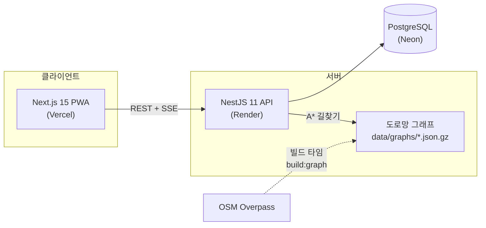

# MOCAR — 카셰어링 시스템 데모

> 쏘카 Product Engineer 포지션 지원을 위해 만든 데모 프로젝트입니다.
> **㈜쏘카와 무관한 개인 학습/포트폴리오용 프로젝트**이며, 결제는 모두 모의(Mock)로 동작합니다.

모빌리티 도메인의 핵심 문제 — **실시간 예약 동시성, 결제 멱등성, 대여 라이프사이클, 운영 의사결정** — 를
End-to-End(기획 → 설계 → 구현 → 테스트 → 배포)로 구현했습니다.

**데모**: 웹 https://socar-demo.vercel.app · API https://mocar-api-d07z.onrender.com/health
(Render 무료 티어는 유휴 시 슬립 상태가 되어 첫 요청에 30초쯤 걸릴 수 있어요)

## 공고 요구사항 ↔ 구현 매핑

| 공고에서 요구한 것 | 이 프로젝트에서 보여주는 것 |
|---|---|
| 모빌리티·결제·실시간 트랜잭션 도메인 | 예약 동시성 제어([ADR-001](docs/adr/001-reservation-concurrency.md)), 모의 PG 멱등성([ADR-002](docs/adr/002-payment-idempotency.md)), 대여~반납 상태 머신 |
| 제품 문제 영역의 owner로서 End-to-End | 기획(요구 정의) → 도메인 설계 → API/웹 구현 → 테스트 → 클라우드 배포 → 운영 지표까지 단독 수행 |
| 기술 스택 경계를 넘는 문제 해결 | 백엔드(NestJS) + 프론트(Next.js) + 데이터(SQL 지표 집계) + 알고리즘(A* 길찾기) + 인프라(배포 파이프라인) |
| 사용자 의사결정을 돕는 제품 감각 | 법인 배차: 자동 배정 대신 **근거를 제시하는 추천 + 담당자 승인**([ADR-003](docs/adr/003-dispatch-scoring.md)) |
| AI 에이전트를 업무에 깊이 통합 | Claude Code로 전 과정을 진행 — [AI 워크플로 기록](docs/ai-workflow.md) |

## 기능

**개인 이용자 (모바일 PWA)** — 실제 앱의 예약 모델을 따름
- **이용 시간을 먼저 정하고** 지도에서 그 시간에 가용한 존/차량 + 예상 요금 탐색 (전국 시드)
- 최소 30분부터 **10분 단위** 예약, 이용 전 **시간 변경**, 이용 중 **반납 연장** (뒤 예약과 충돌 시 409)
- **편도 예약**: 다른 존에 반납 — 차량 위치가 예약 체인을 따라 이동 ([ADR-005](docs/adr/005-oneway-vehicle-location.md))
- **부름(탁송) 수령**: 검색 결과가 "바로 픽업"과 "부름으로 가져와 이용"으로 구분 표시 — 직전 반납 + A* 탁송 시간 기반 가용성 판정 ([ADR-006](docs/adr/006-bureum-delivery.md))
- 면책상품 3종(자기부담금 0/30/70만원) + 쿠폰/크레딧 + 모의 결제 (카드 `0000` 승인 거절 데모)
- 반납하기 원클릭 → 주행거리 자동 확정(모의 텔레메트리) → **30km 무료·전기차 전면 무료** 주행요금 정산

**법인 오피스 (배차 담당자 도구)** — 실제 쏘카 B2B 라인업(쏘카 비즈니스 + 쏘카 FMS)을 리서치해 구성
- **법인 전용 차량(FMS 모델) 우선, 부족하면 인근 공유존 차량 폴백** — 전용 차량은 과금 없음 + 운행일지 자동 기록, 공유 차량은 법인카드 시간당 과금
- 임직원이 차량 요청 → 시스템이 후보 차량을 **근거와 함께** 추천:
  - 전용/공유 여부와 비용 (전용 배지 표시)
  - 오피스 → 존까지 **실제 도로망 A\* 도보 시간** (OSM 기반, 전국 지원)
  - 직전 예약 반납 후 버퍼 시간
  - 차량별 최근 30일 지연 반납 리스크
- 담당자가 추천 근거를 보고 승인/반려 → 승인 시 동시성 제어를 거쳐 예약 생성
- 차량 × 시간 타임라인 보드 · 전용존/전용 차량은 일반 이용자에게 비노출

**운영 어드민**
- 매출/예약/가동률/지연반납률 지표, 일별 차트
- SSE 실시간 차량 현황

## 아키텍처



```
apps/api        NestJS + Prisma — auth/zones/vehicles/reservations/payments/rentals/dispatch/metrics
apps/web        Next.js App Router + Tailwind — 이용자/오피스/어드민 화면, PWA
packages/shared zod 스키마 + 요금 엔진(순수 함수) — API·웹이 같은 계약과 계산을 공유
```

## 핵심 설계 (ADR)

| 문제 | 선택 | 문서 |
|---|---|---|
| 동시 예약 레이스 컨디션 | 트랜잭션 사전검사 + PostgreSQL `EXCLUDE USING GIST` 이중 방어 | [ADR-001](docs/adr/001-reservation-concurrency.md) |
| 중복 결제 방지 | 멱등성 키 + 결제 상태 머신 + 예약과 같은 트랜잭션 경계 | [ADR-002](docs/adr/002-payment-idempotency.md) |
| 배차 의사결정 | 완전 자동화 대신 스코어링 근거를 제시하는 추천 + 사람의 승인 | [ADR-003](docs/adr/003-dispatch-scoring.md) |
| 전국 도로망 vs 무료 인프라 | 전국 지원 전처리 파이프라인 + 지역별 경량 그래프 동봉 | [ADR-004](docs/adr/004-road-graph-pipeline.md) |
| 편도 예약과 차량 위치 | 물리 위치와 계획 위치를 분리 — 위치를 예약 체인의 시간 함수로 계산 | [ADR-005](docs/adr/005-oneway-vehicle-location.md) |
| 부름 가용성 | 시간 겹침만이 아니라 탁송 이동 시간(A* 운전 속도)을 가용성 제약으로 | [ADR-006](docs/adr/006-bureum-delivery.md) |

## 실행 방법

요구사항: Node 20+, pnpm 9, Docker

```bash
pnpm install
pnpm db:up                              # PostgreSQL (docker compose)
pnpm --filter @socar/shared build
pnpm --filter @socar/api exec prisma generate
pnpm --filter @socar/api db:deploy      # 마이그레이션 (EXCLUDE 제약 포함)
pnpm db:seed                            # 데모 데이터
pnpm dev                                # web :3000 + api :4000
```

### 데모 계정 (비밀번호 모두 `demo1234`)

| 이메일 | 역할 | 볼 수 있는 것 |
|---|---|---|
| `user@demo.mocar.kr` | 개인 이용자 | 지도 탐색, 예약~반납, 쿠폰/크레딧 |
| `member@demo.mocar.kr` | 법인 임직원 | 배차 요청, 추천 결과 확인 |
| `admin@demo.mocar.kr` | 법인 배차 담당 | 추천 근거 검토, 승인/반려, 타임라인 보드 |
| `ops@demo.mocar.kr` | 운영 어드민 | 지표 대시보드, 실시간 차량 현황 |

## 테스트

```bash
pnpm test                     # 단위 34케이스: 요금 엔진·배차 스코어링·편도 위치 체인
pnpm --filter @socar/api test:int   # 통합 14케이스: 동시 예약 경합, 연장 충돌, 편도 존 이동, 부름 제약, 변경 차액 (DB 필요)
```

## 스코프 아웃 (의도적 결정)

패스포트 구독 · 하이패스 통행료 후불 합산 · 실사고/보험 청구 플로우 · 부름+편도 조합은
데모 범위에서 제외했다. 실제 상품과 이 데모의 관계는 [ADR-003](docs/adr/003-dispatch-scoring.md),
[ADR-005](docs/adr/005-oneway-vehicle-location.md), [ADR-006](docs/adr/006-bureum-delivery.md)에 명시.

## 실데이터 파이프라인 (전국 지원)

거점 좌표(`apps/api/scripts/regions.ts`)에 도시를 추가하면 두 파이프라인이 함께 커버합니다.

```bash
pnpm --filter @socar/api build:graph   # 도로망: OSM 보행 도로 → A* 그래프 (data/graphs/*.json.gz)
pnpm --filter @socar/api build:zones -- --std /path/to/전국주차장정보표준데이터.json
                                       # 존: 실제 주차장 → data/zones.json (시드가 읽음)
```

존 데이터는 **[전국주차장정보표준데이터](https://www.data.go.kr/data/15012896/standard.do)**(공공데이터포털)를
우선 사용하고, 커버리지가 부족한 지역은 OSM `amenity=parking`으로 보충합니다.
현재 시드는 실제 주차장 30곳 (표준데이터 27 + OSM 3) — 이름·주소·면수가 실데이터입니다.

> 데이터 출처: 전국주차장정보표준데이터(공공누리 제1유형) · © OpenStreetMap contributors (ODbL)

## 배포

- **웹**: Vercel — Root Directory를 `apps/web`으로 설정, `NEXT_PUBLIC_API_URL` 환경변수 지정
- **DB**: Neon — 무료 PostgreSQL, 연결 문자열을 Render에 입력
- **API**: Render — 저장소 루트의 `render.yaml` Blueprint 사용 (`DATABASE_URL`, `WEB_ORIGIN` 입력)

### 콜드 스타트 대응

Render 무료 티어는 유휴 15분 후 슬립되어 첫 요청이 30~60초 걸린다. 두 겹으로 대응:

1. **웜업 게이트** (`apps/web/src/components/ServerWarmup.tsx`): 접속 시 `/health`를 확인해
   서버가 잠들어 있으면 진행 상황 오버레이를 띄우고, 깨어나면 SWR 캐시 전체를 재검증한다
2. **외부 킵얼라이브 (선택)**: [UptimeRobot](https://uptimerobot.com) 무료 플랜으로
   `/health`를 5분 간격 모니터링하면 슬립 자체를 막을 수 있다 (Render 무료 750시간/월로
   단일 서비스 상시 가동 가능). GitHub Actions cron은 저장소가 public일 때만 무료라는 점 주의

### 배포 DB 재시드

시드 데이터가 바뀌면(존 교체 등) Render 환경변수 `AUTO_SEED`를 `force`로 바꿔 재배포 —
부팅 시 전체 재시드된다. **끝나면 반드시 `true`로 되돌릴 것** (force 상태로 두면 부팅마다 초기화).

## 기술 스택

NestJS 11 · Prisma 6 · PostgreSQL 16 · Next.js 15 · React 19 · Tailwind v4 · zod ·
Leaflet(OSM) · Recharts · SSE · Jest/Vitest/Supertest · pnpm workspaces · Turborepo
