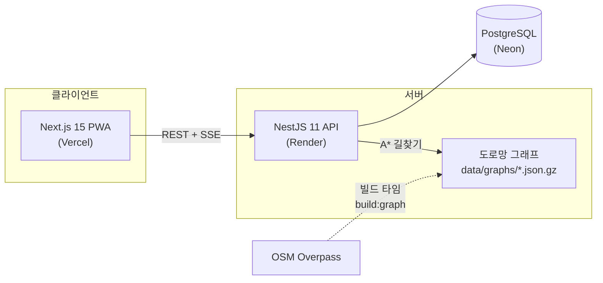

# MOCAR — 카셰어링 시스템 데모

> 쏘카 Product Engineer 포지션 지원을 위해 만든 데모 프로젝트입니다.
> **㈜쏘카와 무관한 개인 학습/포트폴리오용 프로젝트**이며, 결제는 모두 모의(Mock)로 동작합니다.

모빌리티 도메인의 핵심 문제 — **실시간 예약 동시성, 결제 멱등성, 대여 라이프사이클, 운영 의사결정** — 를
End-to-End(기획 → 설계 → 구현 → 테스트 → 배포)로 구현했습니다.

**데모**: 웹 https://socar-demo.vercel.app · API https://mocar-api-d07z.onrender.com/health
(Render 무료 티어는 유휴 시 슬립 상태가 되어 첫 요청에 30초쯤 걸릴 수 있어요)

## 바로 둘러보기

로그인 화면의 데모 계정 버튼을 누르면 역할마다 다른 화면이 열립니다. 비밀번호는 모두 `demo1234`입니다.

| 계정 | 역할 | 열리는 화면 |
|---|---|---|
| `user@demo.mocar.kr` | 개인 이용자 | `/` — 지도 탐색, 예약~반납, 쿠폰/크레딧 |
| `viewer@demo.mocar.kr` | 법인 임직원 · `VIEWER` | `/biz` — 배차 현황 조회만 |
| `member@demo.mocar.kr` | 법인 임직원 · `REQUESTER` | `/biz` — + 배차 요청, 추천 결과 확인 |
| `approver@demo.mocar.kr` | 법인 임직원 · `APPROVER` | `/biz` — + 추천 근거 검토, 승인/반려, 타임라인 보드 |
| `admin@demo.mocar.kr` | 법인 배차 담당 · `MANAGER` | `/biz` — + 멤버 등급 관리, 플릿/리스 관리 |
| `ops@demo.mocar.kr` | 운영 어드민 | `/dashboard` — 운영 센터 7탭 · `/ops/leases` 리스 요청 처리 |
| `handler@demo.mocar.kr` | 핸들러(운송기사) | `/handler` — 부름 배달·회수·재배치 작업 큐 |

법인 계정 네 개는 **법인 등급**만 다릅니다. `/biz`의 권한은 전역 역할이 아니라 이 등급에서 나오므로,
계정을 바꿔 가며 등급별 화면과 권한을 비교할 수 있습니다.

## 공고 요구사항 ↔ 구현 매핑

| 공고에서 요구한 것 | 이 프로젝트에서 보여주는 것 |
|---|---|
| 모빌리티·결제·실시간 트랜잭션 도메인 | 예약 동시성 제어([ADR-001](docs/adr/001-reservation-concurrency.md)), 모의 PG 멱등성([ADR-002](docs/adr/002-payment-idempotency.md)), 대여~반납 상태 머신 |
| 제품 문제 영역의 owner로서 End-to-End | 기획(요구 정의) → 도메인 설계 → API/웹 구현 → 테스트 → 클라우드 배포 → 운영 지표까지 단독 수행 |
| 기술 스택 경계를 넘는 문제 해결 | 백엔드(NestJS) + 프론트(Next.js) + 데이터(SQL 지표 집계) + 알고리즘(A* 길찾기) + 인프라(배포 파이프라인) |
| 사용자 의사결정을 돕는 제품 감각 | 법인 배차: 자동 배정 대신 **근거를 제시하는 추천 + 담당자 승인**([ADR-003](docs/adr/003-dispatch-scoring.md)) |
| AI 에이전트를 업무에 깊이 통합 | Claude Code로 전 과정을 진행 — [AI 워크플로 기록](docs/ai-workflow.md) |

## 기능

사용자 유형 넷에 전용 화면이 하나씩 있습니다. 여기에는 영역별 핵심만 적었고, 전체 목록은 [기능 상세](docs/features.md)에 있습니다.

**개인 이용자 — 모바일 PWA (`/`)**
- **시간이 먼저, 차는 그다음** — 이용 시간을 정하면 그 시간에 가용한 존·차량과 예상 요금을 지도에 표시 (30분부터 10분 단위)
- **편도·부름** — 다른 존에 반납하거나([ADR-005](docs/adr/005-oneway-vehicle-location.md)) 탁송으로 차를 받아 이용([ADR-006](docs/adr/006-bureum-delivery.md)). 예약 변경·반납 연장 지원
- **이용 플로우** — 체크인(촬영) → 가상 스마트키 → 이용 중(연장·사고 접수) → 체크아웃(촬영) → 반납·정산.
  체크인해야 스마트키가 열리고 체크아웃해야 반납이 열림 ([ADR-007](docs/adr/007-checkin-gate-smartkey.md))
- **결제·정산** — 면책상품 3종, 쿠폰/크레딧, 모의 결제(카드 `0000`은 승인 거절 데모), 30km 무료·전기차 무료 주행요금

**MOCAR 비즈니스 — 법인 플릿/리스 관리 (`/biz`)**
- 소비자 앱의 부속이 아니라 **분리된 서비스 경계** — 전용 셸 · 전용 API 네임스페이스 · 포트/어댑터 ([ADR-010](docs/adr/010-biz-separation-and-permissions.md))
- **권한은 법인 등급에서** — 등급→권한 매핑이 shared 상수 하나라 API 가드와 화면 분기가 같은 표를 봄
- **근거를 제시하는 배차 추천 + 사람의 승인** — 전용/공유 비용, 도로망 A\* 도보 시간, 반납 버퍼, 지연 반납 리스크
- **플릿·리스** — 만기 D-day · 이용률 · 운행일지. 연장/해지는 법인이 *요청*하고 운영 어드민이 *결정*

**핸들러 — 운송기사 (`/handler`)**
- 부름을 "차가 알아서 오는 기능"이 아니라 **사람이 하는 일**로 모델링 — 예약 한 건이 작업 두 건(배달 → 회수) ([ADR-008](docs/adr/008-handler-task-system.md))
- 작업은 **예약/정산과 같은 트랜잭션**에서 생성 — 결제는 됐는데 배달 작업이 없는 상태를 만들지 않음
- 수락 → 이동 → 완료(인계 사진). 완료가 차량 위치를 확정하고, **이동을 시작한 작업은 취소·재배정 불가**

**운영 센터 — 운영 어드민 (`/dashboard`)**
- **7탭 운영 도구** — 운영 홈 · 차량 · 작업/배차 · 존/계약 · 고객 · 회계 · 리포트.
  탭 경계는 도메인 모델이 아니라 **운영자가 답을 찾는 질문**을 따름 ([ADR-009](docs/adr/009-ops-backoffice-telemetry.md))
- **경고 피드 4종 + SSE 실시간 차량 지도** — 경고를 누르면 그 탭의 그 행이 열림
- **결정적 텔레메트리 모의** — 워커 없이 조회 시점에 계산. 계기판 주행거리와 반납 정산 거리가 같은 함수에서 나옴
- **리포트 빌더** — 지표 5종 × 축 × 필터를 조립, 필터는 URL에 남고 CSV/JSON으로 내보내기(엑셀 호환)

## 핵심 설계 (ADR)

| 문제 | 선택 | 문서 |
|---|---|---|
| 동시 예약 레이스 컨디션 | 트랜잭션 사전검사 + PostgreSQL `EXCLUDE USING GIST` 이중 방어 | [ADR-001](docs/adr/001-reservation-concurrency.md) |
| 중복 결제 방지 | 멱등성 키 + 결제 상태 머신 + 예약과 같은 트랜잭션 경계 | [ADR-002](docs/adr/002-payment-idempotency.md) |
| 배차 의사결정 | 완전 자동화 대신 스코어링 근거를 제시하는 추천 + 사람의 승인 | [ADR-003](docs/adr/003-dispatch-scoring.md) |
| 전국 도로망 vs 무료 인프라 | 전국 지원 전처리 파이프라인 + 지역별 경량 그래프 동봉 | [ADR-004](docs/adr/004-road-graph-pipeline.md) |
| 편도 예약과 차량 위치 | 물리 위치와 계획 위치를 분리 — 위치를 예약 체인의 시간 함수로 계산 | [ADR-005](docs/adr/005-oneway-vehicle-location.md) |
| 부름 가용성 | 시간 겹침만이 아니라 탁송 이동 시간(A* 운전 속도)을 가용성 제약으로 | [ADR-006](docs/adr/006-bureum-delivery.md) |
| 인수인계 증거 vs 이용 마찰 | 체크인을 스마트키의 선행 조건으로 — 규칙은 shared 순수 함수 하나에 | [ADR-007](docs/adr/007-checkin-gate-smartkey.md) |
| 사람이 하는 일(부름 배달/회수) | 예약과 같은 트랜잭션에서 작업 생성 · 이동 중 작업은 취소 불가 · 완료가 차량 위치를 확정 | [ADR-008](docs/adr/008-handler-task-system.md) |
| 운영 백오피스와 차량 센서 | 매출 화면을 탭형 운영 센터로 · 워커 없는 **결정적** 텔레메트리 모의(계기판 = 청구 거리) | [ADR-009](docs/adr/009-ops-backoffice-telemetry.md) |
| 법인 서비스 분리와 권한 | `/biz` 바운디드 컨텍스트(포트/어댑터로 좁힌 의존) + 권한을 전역 역할이 아닌 법인 등급에서 | [ADR-010](docs/adr/010-biz-separation-and-permissions.md) |

## 아키텍처



```
apps/api        NestJS + Prisma — auth/zones/vehicles/reservations/payments/rentals/metrics
                + biz/ (MOCAR 비즈니스 바운디드 컨텍스트) · handler/ (운송기사 작업)
                · ops/ (운영 센터 — fleet·zones·users·inquiries·accounting·alerts·tasks)
                · telemetry/ (차량 센서 모의 엔진 — 순수 함수 + 조회 시점 계산)
apps/web        Next.js App Router + Tailwind — 이용자/비즈니스(/biz)/핸들러/어드민 화면, PWA
packages/shared zod 스키마 + 요금 엔진(순수 함수) — API·웹이 같은 계약과 계산을 공유
```

## 실행 방법

요구사항: Node 20+, pnpm 9, Docker

```bash
pnpm install
pnpm db:up                              # PostgreSQL (docker compose)
pnpm --filter @socar/shared build
pnpm --filter @socar/api exec prisma generate
pnpm --filter @socar/api db:deploy      # 마이그레이션 (EXCLUDE 제약 포함)
pnpm db:seed                            # 데모 데이터
pnpm dev                                # web :3000 + api :4000
```

## 테스트

```bash
pnpm test                           # 단위 170 + 프론트 246 — DB·서버 없이 돈다
pnpm --filter @socar/api test:int   # 통합 292 — 실제 PostgreSQL 필요
```

| 층 | 수 | 도구 | 무엇을 지키나 |
|---|--:|---|---|
| 단위 | 170 | Vitest · Jest | 요금·정산, 권한 매핑, 상태 머신 같은 순수 함수 규칙 |
| 프론트 | 246 | Vitest + RTL + MSW | 역할·등급별 화면 분기와 화면 동선 |
| 통합 | 292 | Supertest + 실제 PostgreSQL | 동시성·트랜잭션·권한 가드·E2E 동선 |

- **권한 매트릭스는 손으로 적지 않습니다** — 엔드포인트는 Nest 라우트 메타데이터에서, 기대값은 shared 권한표에서 뽑아
  데코레이터를 빠뜨린 새 엔드포인트를 테스트가 먼저 잡습니다
- **프론트 목은 shared 응답 스키마로 `parse`해서 만듭니다** — API 계약이 바뀌면 목이 먼저 깨집니다

대상별 개수와 E2E 시나리오는 [테스트 상세](docs/testing.md)에 있습니다.

## 배포

웹 Vercel · API Render(`render.yaml` Blueprint) · DB Neon — 전부 무료 티어입니다.
shared 빌드 순서는 `prebuild` 스크립트로 저장소에 고정했고, 시드는 `SEED_VERSION` 마커로 배포 시 자동 1회 재적재되며,
Render 콜드 스타트는 웹의 웜업 게이트가 받아 줍니다. 설정 방법과 배포 후 스모크 체크리스트는 [배포 문서](docs/deployment.md)에 있습니다.

## 스코프 아웃 (의도적 결정)

뺀 것에도 이유를 남겼습니다. 실제 상품과 이 데모가 갈라지는 지점은
[ADR-003](docs/adr/003-dispatch-scoring.md) · [ADR-005](docs/adr/005-oneway-vehicle-location.md) ·
[ADR-006](docs/adr/006-bureum-delivery.md) · [ADR-007](docs/adr/007-checkin-gate-smartkey.md)에 적혀 있습니다.

- **이용자** — 패스포트 구독 · 하이패스 통행료 후불 합산 · 실제 보험사 청구 연동(사고 접수는 모의까지) · 부름+편도 조합.
  실물 쏘카 스마트키에 없는 **시동을 데모에 넣은 이유**는 [ADR-007](docs/adr/007-checkin-gate-smartkey.md)
- **핸들러** — 실시간 위치 추적 · 작업 묶음·경로 최적화(VRP) · 정산·수당 · 기한 임박 작업 자동 배정 ([ADR-008](docs/adr/008-handler-task-system.md))
- **운영** — 실제 OBD/텔레매틱스 연동(교체 지점만 정의) · 백그라운드 워커·알림 발송 · 위치 이력 저장 · 정비 입출고 · 감가상각·세금·인건비 ([ADR-009](docs/adr/009-ops-backoffice-telemetry.md))
- **Export** — CSV 수식 인젝션 방어는 알고 넣지 않았습니다 ([이유와 바뀌는 조건](docs/features.md#의식적으로-넣지-않은-것--csv-수식-인젝션-방어))

## 기술 스택

NestJS 11 · Prisma 6 · PostgreSQL 16 · Next.js 15 · React 19 · Tailwind v4 · zod ·
Leaflet(OSM) · Chart.js · SSE · Jest/Vitest/Supertest · pnpm workspaces · Turborepo

존은 실제 주차장 30곳, 도로망은 OSM 기반 A\* 그래프입니다 — [실데이터 파이프라인](docs/data-pipeline.md).
데이터 출처: 전국주차장정보표준데이터(공공누리 제1유형) · © OpenStreetMap contributors (ODbL)

## 문서

| 문서 | 내용 |
|---|---|
| [기능 상세](docs/features.md) | 네 영역의 전체 기능, 운영 센터 탭별 역할, 리포트·내보내기 규칙 |
| [ADR 001~010](docs/adr/) | 핵심 설계 결정과 스코프 아웃의 근거 |
| [테스트 상세](docs/testing.md) | 단위·프론트·통합 테스트 대상별 개수와 E2E 시나리오 |
| [배포](docs/deployment.md) | Vercel·Render·Neon 설정, 스모크 체크리스트, 콜드 스타트, 시드 버전 관리 |
| [실데이터 파이프라인](docs/data-pipeline.md) | 공공데이터·OSM에서 존과 도로망 그래프를 만드는 방법 |
| [AI 워크플로](docs/ai-workflow.md) | Claude Code와 분업한 방식의 기록 |
