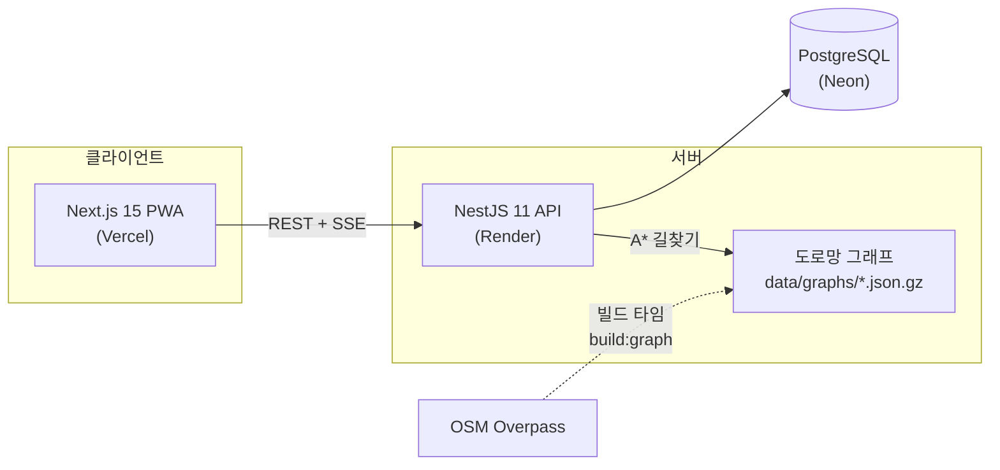

# MOCAR — 카셰어링 시스템 데모

> 쏘카 Product Engineer 포지션 지원을 위해 만든 데모 프로젝트입니다.
> **㈜쏘카와 무관한 개인 학습/포트폴리오용 프로젝트**이며, 결제는 모두 모의(Mock)로 동작합니다.

모빌리티 도메인의 핵심 문제 — **실시간 예약 동시성, 결제 멱등성, 대여 라이프사이클, 운영 의사결정** — 를
End-to-End(기획 → 설계 → 구현 → 테스트 → 배포)로 구현했습니다.

<!-- TODO: 배포 후 링크/스크린샷 교체 -->
**데모**: 웹 https://mocar.vercel.app · API https://mocar-api.onrender.com/health
(Render 무료 티어는 유휴 시 슬립 상태가 되어 첫 요청에 30초쯤 걸릴 수 있어요)

## 공고 요구사항 ↔ 구현 매핑

| 공고에서 요구한 것 | 이 프로젝트에서 보여주는 것 |
|---|---|
| 모빌리티·결제·실시간 트랜잭션 도메인 | 예약 동시성 제어([ADR-001](docs/adr/001-reservation-concurrency.md)), 모의 PG 멱등성([ADR-002](docs/adr/002-payment-idempotency.md)), 대여~반납 상태 머신 |
| 제품 문제 영역의 owner로서 End-to-End | 기획(요구 정의) → 도메인 설계 → API/웹 구현 → 테스트 → 클라우드 배포 → 운영 지표까지 단독 수행 |
| 기술 스택 경계를 넘는 문제 해결 | 백엔드(NestJS) + 프론트(Next.js) + 데이터(SQL 지표 집계) + 알고리즘(A* 길찾기) + 인프라(배포 파이프라인) |
| 사용자 의사결정을 돕는 제품 감각 | 법인 배차: 자동 배정 대신 **근거를 제시하는 추천 + 담당자 승인**([ADR-003](docs/adr/003-dispatch-scoring.md)) |
| AI 에이전트를 업무에 깊이 통합 | Claude Code로 전 과정을 진행 — [AI 워크플로 기록](docs/ai-workflow.md) |

## 기능

**개인 이용자 (모바일 PWA)**
- 지도에서 전국 쏘카존/차량 탐색 (서울·부산·대전·제주 시드)
- 30분 슬롯 예약 + 보험 선택 + 쿠폰/크레딧 + 모의 결제 (카드 `0000` 입력 시 승인 거절 데모)
- 스마트키(이용 시작) → 반납 → 주행요금·지연요금 자동 정산

**법인 오피스 (배차 담당자 도구)**
- 임직원이 차량 요청 → 시스템이 후보 차량을 **근거와 함께** 추천:
  - 오피스 → 존까지 **실제 도로망 A\* 도보 시간** (OSM 기반, 전국 지원)
  - 직전 예약 반납 후 버퍼 시간
  - 차량별 최근 30일 지연 반납 리스크
- 담당자가 추천 근거를 보고 승인/반려 → 승인 시 동시성 제어를 거쳐 예약 생성
- 차량 × 시간 타임라인 보드

**운영 어드민**
- 매출/예약/가동률/지연반납률 지표, 일별 차트
- SSE 실시간 차량 현황

## 아키텍처



```
apps/api        NestJS + Prisma — auth/zones/vehicles/reservations/payments/rentals/dispatch/metrics
apps/web        Next.js App Router + Tailwind — 이용자/오피스/어드민 화면, PWA
packages/shared zod 스키마 + 요금 엔진(순수 함수) — API·웹이 같은 계약과 계산을 공유
```

## 핵심 설계 (ADR)

| 문제 | 선택 | 문서 |
|---|---|---|
| 동시 예약 레이스 컨디션 | 트랜잭션 사전검사 + PostgreSQL `EXCLUDE USING GIST` 이중 방어 | [ADR-001](docs/adr/001-reservation-concurrency.md) |
| 중복 결제 방지 | 멱등성 키 + 결제 상태 머신 + 예약과 같은 트랜잭션 경계 | [ADR-002](docs/adr/002-payment-idempotency.md) |
| 배차 의사결정 | 완전 자동화 대신 스코어링 근거를 제시하는 추천 + 사람의 승인 | [ADR-003](docs/adr/003-dispatch-scoring.md) |
| 전국 도로망 vs 무료 인프라 | 전국 지원 전처리 파이프라인 + 지역별 경량 그래프 동봉 | [ADR-004](docs/adr/004-road-graph-pipeline.md) |

## 실행 방법

요구사항: Node 20+, pnpm 9, Docker

```bash
pnpm install
pnpm db:up                              # PostgreSQL (docker compose)
pnpm --filter @socar/shared build
pnpm --filter @socar/api exec prisma generate
pnpm --filter @socar/api db:deploy      # 마이그레이션 (EXCLUDE 제약 포함)
pnpm db:seed                            # 데모 데이터
pnpm dev                                # web :3000 + api :4000
```

### 데모 계정 (비밀번호 모두 `demo1234`)

| 이메일 | 역할 | 볼 수 있는 것 |
|---|---|---|
| `user@demo.mocar.kr` | 개인 이용자 | 지도 탐색, 예약~반납, 쿠폰/크레딧 |
| `member@demo.mocar.kr` | 법인 임직원 | 배차 요청, 추천 결과 확인 |
| `admin@demo.mocar.kr` | 법인 배차 담당 | 추천 근거 검토, 승인/반려, 타임라인 보드 |
| `ops@demo.mocar.kr` | 운영 어드민 | 지표 대시보드, 실시간 차량 현황 |

## 테스트

```bash
pnpm test                     # 단위: 요금 엔진 12케이스 + 배차 스코어링 6케이스
pnpm --filter @socar/api test:int   # 통합: 동시 예약 10건 → 1건만 성공, 롤백/멱등성 (DB 필요)
```

## 도로망 그래프 재생성 (전국 지원)

```bash
pnpm --filter @socar/api build:graph          # 모든 지역
pnpm --filter @socar/api build:graph -- seoul # 특정 지역
```

`apps/api/scripts/build-graph.ts`의 `REGIONS`에 중심 좌표를 추가하면 전국 어느 지역이든
OSM에서 보행 도로망을 받아 경량 그래프(`data/graphs/*.json.gz`)로 만듭니다.

## 배포

- **웹**: Vercel — Root Directory를 `apps/web`으로 설정, `NEXT_PUBLIC_API_URL` 환경변수 지정
- **API**: Render — 저장소 루트의 `render.yaml` Blueprint 사용 (`DATABASE_URL`, `WEB_ORIGIN` 입력)
- **DB**: Neon — 무료 PostgreSQL, 연결 문자열을 Render에 입력

## 기술 스택

NestJS 11 · Prisma 6 · PostgreSQL 16 · Next.js 15 · React 19 · Tailwind v4 · zod ·
Leaflet(OSM) · Recharts · SSE · Jest/Vitest/Supertest · pnpm workspaces · Turborepo
